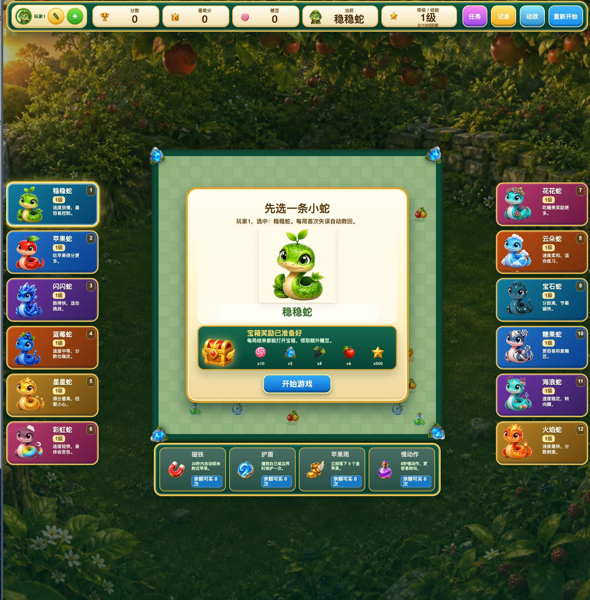

<div align="center">

# 🐍 贪吃蛇吃苹果

**单文件 HTML5 桌面游戏 · 12 条带天赋小蛇 · 果园竞技场视觉 · 双击即玩，零依赖**

[](./outputs/docs/CHANGELOG.md)
[](./outputs/snake-game.html)
[](./outputs/LICENSE)
[](#-12-条小蛇各有天赋)
[](#-果园竞技场视觉系统)

**[English Documentation](./README.en.md)** · [中文文档](./README.md)（默认）

</div>

---

## 🎮 真实界面（v0.5.0 当前版本）

<p align="center">
  <a href="outputs/snake-game-snake-select-latest.png"></a>
</p>

> **真实截图**（2026-09-21 手动截取）：完整的开局选蛇界面 — 左右各 6 条带天赋小蛇卡片（编号 1-12）、中央"先选一条小蛇"对话框显示当前玩家选中的稳稳蛇、顶部 HUD 显示玩家 1 / 分数 / 最高分 / 糖豆 / 当前蛇 / 等级经验、底部 4 个局内功能按钮（磁铁 / 护盾 / 苹果雨 / 慢动作）。

---

## 这是什么

**贪吃蛇吃苹果** 是一款**单文件 HTML5 桌面游戏**：

- 🐍 **12 条带天赋小蛇**（左右各 6 条）— 每条都有独特的速度、得分倍率、被动天赋
- 🎯 **果园竞技场视觉系统** — 完整背景图、果实装饰、HUD 美化（v0.5.0 阶段重做）
- 🎮 **4 个局内功能** — 磁铁（自动吸附附近苹果）/ 护盾（撞边界保护一次）/ 苹果雨（5 秒下 5 个金苹果）/ 慢动作（8 秒慢速转动）
- 💎 **糖豆经济 + 等级经验** — 每局获得糖豆可在局内商店购买功能，经验提升等级
- 🏆 **宝箱奖励系统** — 每局结束根据表现开出宝箱（糖豆 / 经验 / 道具 / 苹果 / 星星）
- 👤 **多玩家档案** — 每个玩家独立保存等级、糖豆、历史、任务、收藏、选蛇、主题、待领取宝箱
- ⚡ **零依赖** — 双击 `snake-game.html` 直接玩，无需安装、无需构建、无需服务器

> **第二句**：跟其他贪吃蛇游戏不一样——这是一款有**角色养成** + **RPG 元素** + **果园美学**的贪吃蛇，12 条小蛇各有天赋树。

---

## ✨ 6 条核心亮点

1. **🐍 12 条带天赋的小蛇** — 速度、倍率、被动天赋各异，每条蛇有独立性格（参考截图左右两侧的蛇卡）
2. **🎮 4 个局内功能按钮** — 磁铁 / 护盾 / 苹果雨 / 慢动作，糖豆可在商店购买
3. **🏆 宝箱奖励 + 糖豆经济** — 每局结束根据表现开出宝箱（糖豆 / 经验 / 道具 / 苹果 / 星星）
4. **📈 20 级成长系统** — 糖豆、历史、任务、收藏、选蛇、主题全持久化
5. **👤 多玩家档案** — 每个玩家独立保存进度，关闭浏览器也不丢
6. **🌳 果园竞技场视觉系统** — 完整视觉规范（VISUAL.md），不是简陋像素风

---

## 🚀 60 秒快速开始

### 第 1 步 · 下载

```bash
git clone https://github.com/davyzhong/snake-game.git
cd snake-game
```

### 第 2 步 · 打开

```bash
# macOS
open outputs/snake-game.html

# Linux
xdg-open outputs/snake-game.html

# Windows
start outputs/snake-game.html
```

### 第 3 步 · 开始玩

- **方向键 / WASD** — 移动
- **空格** — 暂停 / 恢复
- **切出页面** — 自动暂停（限时道具不会被后台时间消耗）

> **零构建步骤**：无需 `npm install`、无需启动 dev server、无需任何依赖。

---

## 📸 截图矩阵

> ⚠️ **v0.5.0 截图更新进行中**：当前只有一张手动截取的"选蛇界面"。其余场景（游戏中 / 暂停 / 任务详情 / 升级系统 / 移动端）截图待补。**欢迎 PR 投稿最新截图** — 见下方"截图贡献指引"。

| 场景 | 截图文件 | 状态 |
|---|---|---|
| **选蛇界面（hero）** | `snake-game-snake-select-latest.png` | ✅ 已截（2026-09-21）|
| 游戏中棋盘 + 12 蛇对局 | `_TODO_` | 📸 待补 |
| 暂停界面（v0.5.0 切出自动暂停）| `_TODO_` | 📸 待补 |
| 升级系统 + 任务详情 | `_TODO_` | 📸 待补 |
| 特殊苹果系统（金/蓝/紫/红）| `_TODO_` | 📸 待补 |
| 移动端响应式布局 | `_TODO_` | 📸 待补 |

### 📸 截图贡献指引

如果你想贡献最新截图：

1. **打开游戏**：`open outputs/snake-game.html`
2. **截图操作**：
   - macOS：`Cmd + Shift + 4` 选区截图，或 `Cmd + Shift + 5` 录屏后取帧
   - 推荐分辨率：**1280×800**（桌面）或 **390×844**（移动模拟）
3. **保存格式**：PNG，无压缩，文件名语义化（如 `snake-game-playing.png`）
4. **放到 outputs/**：`outputs/snake-game-<场景名>.png`
5. **更新 README**：把 `<场景名>` 加到上面的矩阵
6. **提交 PR**：标题写 `docs(assets): 添加 <场景名> 截图`

---

## 📚 完整文档

| 文档 | 内容 |
|---|---|
| [outputs/docs/GAMEPLAY.md](./outputs/docs/GAMEPLAY.md) | 操作、蛇、食物、成长、道具和任务系统（204 行）|
| [outputs/docs/STORAGE.md](./outputs/docs/STORAGE.md) | 玩家存档和数据边界 |
| [outputs/docs/VISUAL.md](./outputs/docs/VISUAL.md) | 棋盘对齐、素材、渲染和视觉规范 |
| [outputs/docs/ARCHITECTURE.md](./outputs/docs/ARCHITECTURE.md) | 状态、规则、渲染和性能结构 |
| [outputs/docs/DEVELOPMENT.md](./outputs/docs/DEVELOPMENT.md) | 运行、检查和维护方式 |
| [outputs/docs/ROADMAP.md](./outputs/docs/ROADMAP.md) | 已实现内容和后续方向 |
| [outputs/docs/CHANGELOG.md](./outputs/docs/CHANGELOG.md) | 版本记录 |

---

## 🏗️ 项目结构

```text
snake-game/
├── README.md           ← 你正在看的（v2 中文为主）
├── README.en.md        ← 英文版
├── outputs/
│   ├── snake-game.html ← 主程序（单文件 HTML5 游戏）
│   ├── snake-game-snake-select-latest.png ← 最新截图（2026-09-21）
│   ├── AGENTS.md       ← Codex 工作指南
│   ├── CLAUDE.md       ← Claude 工作指南
│   ├── assets/         ← 棋盘素材（蛇头、蛇颈、果园装饰等 PNG）
│   └── docs/           ← 项目文档（7 个 .md）
└── work/
    ├── tests/          ← Node 自动检查
    └── chrome-snake-shot-profile/  ← 本地浏览器配置（gitignored）
```

---

## 🛠️ 技术栈

- **HTML5** + **CSS3** + **Vanilla JavaScript**
- **Canvas 2D** 渲染
- **localStorage** 玩家档案持久化
- **零依赖、零构建、零服务器**

---

## 🗓️ Roadmap

- [x] **v0.1** — 单条蛇基础版
- [x] **v0.2** — 多蛇系统
- [x] **v0.3** — 阶段 1 视觉重做
- [x] **v0.4** — 天赋 + 任务系统
- [x] **v0.5**（当前）— 12 条带天赋小蛇 + 20 级成长 + 玩家档案 + 宝箱持久化 + 果园竞技场视觉
- [ ] **v0.5.1** — README 截图自动化（Playwright + CI）
- [ ] **v0.6** — 多人在线对战（计划中）
- [ ] **v1.0** — 完整 RPG 化（天赋树、技能、装备系统）

详见 [outputs/docs/ROADMAP.md](./outputs/docs/ROADMAP.md)

---

## 🤝 贡献 & Code of Conduct

欢迎贡献！详见 [CONTRIBUTING.md](./CONTRIBUTING.md)（如未提供请提 issue）。
本项目采用 [Contributor Covenant](CODE_OF_CONDUCT.md) v2.1（**TODO**: 添加）。

## 🔒 Security

发现安全漏洞请私下联系：security@example.dev，详见 [SECURITY.md](./SECURITY.md)（**TODO**: 添加）。

## 📜 License

[MIT](./outputs/LICENSE) — 拿去用，注明出处。

---

<div align="center">
<sub>🐍 <b>贪吃蛇的现代化演绎：单文件 + 零依赖 + RPG 元素 + 果园美学。</b></sub>
<br><br>
<sub>🎮 现在打开 <a href="./outputs/snake-game.html">outputs/snake-game.html</a> 即可游玩。</sub>
</div>