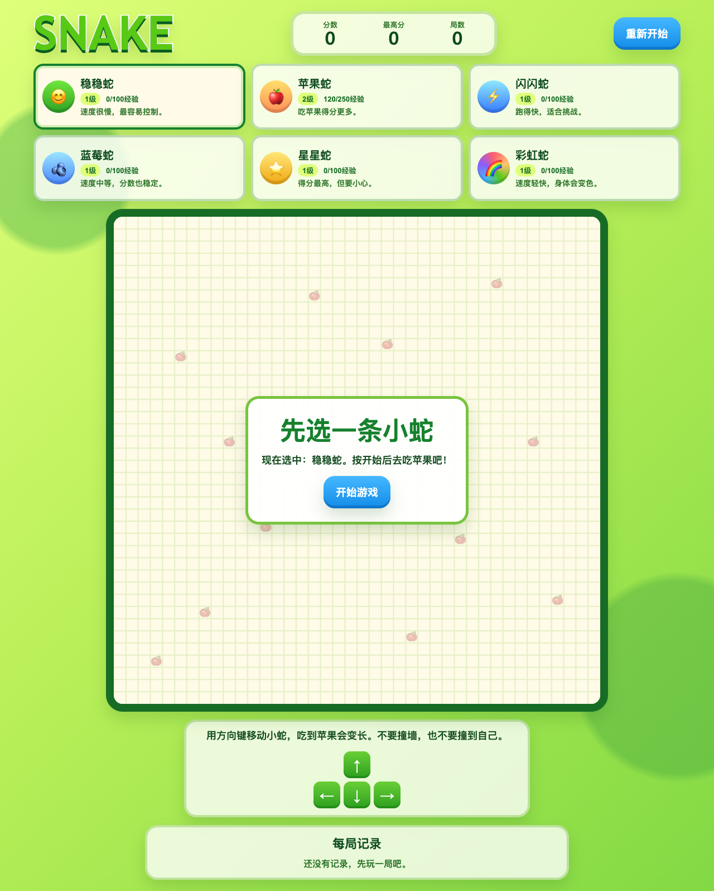
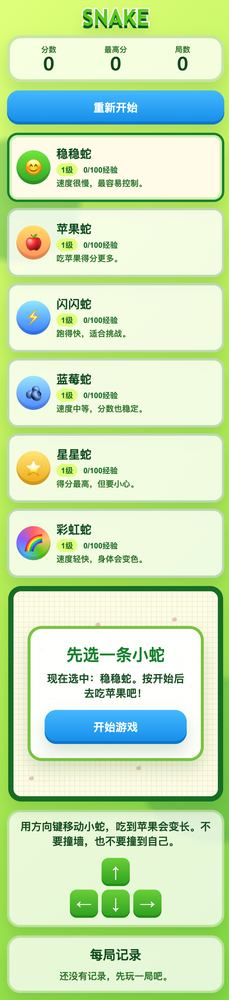
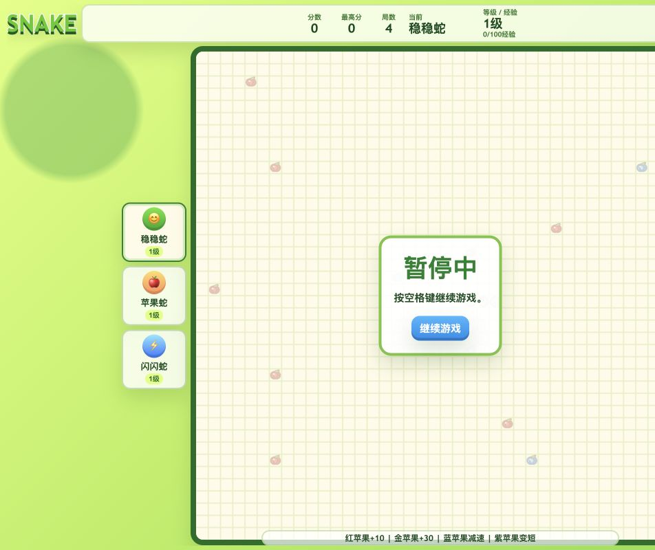
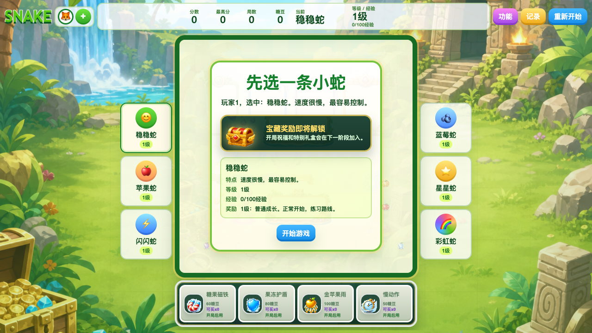
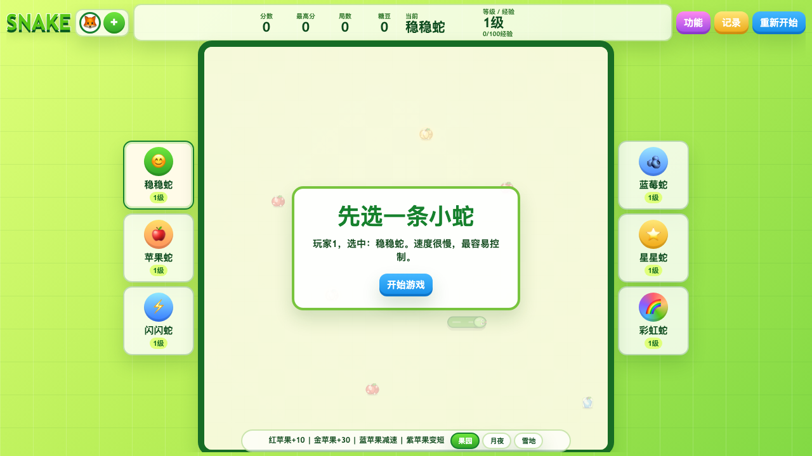
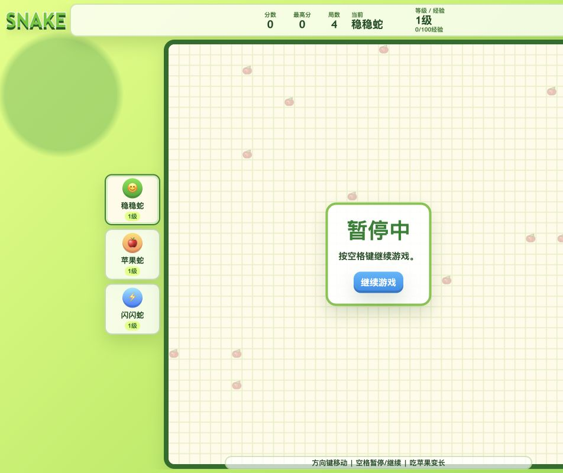

<div align="center">

# 🐍 贪吃蛇吃苹果

**单文件 HTML5 桌面游戏 · 12 条带天赋小蛇 · 26×26 大棋盘 · 双击即玩，零依赖**

[](./outputs/CHANGELOG.md)
[](./outputs/snake-game.html)
[](./LICENSE)
[](#-12-条小蛇各有天赋)
[](#-26×26-大格棋盘)

**[English](./README.en.md)** · [中文（默认）](./README.md)

</div>

---

## 这是什么

**贪吃蛇吃苹果** 是一款**单文件 HTML5 桌面游戏**：

- 🍎 12 条带天赋小蛇同时上场（速度 / 倍率 / 被动天赋各不同）
- 🎯 26×26 大格棋盘，12 个食物同时出现
- 📈 20 级成长系统 + 局内道具 + 任务系统
- 💎 随机奖励 + 玩家档案 + 宝箱持久化
- 🌳 果园竞技场视觉系统
- ⚡ **零依赖** — 双击 `snake-game.html` 直接玩，无需安装、无需构建、无需服务器

> **第二句**：跟其他贪吃蛇游戏不一样——这是一款有**角色养成**和**RPG 元素**的贪吃蛇，每条小蛇都有独立天赋树。

---

## ✨ 6 条核心亮点

1. **🎯 12 条带天赋的小蛇** — 速度、倍率、被动天赋各异，每条蛇有独立性格
2. **🎲 26×26 大格棋盘** — 12 个食物同时出现，节奏紧凑、信息密度高
3. **📈 20 级成长系统** — 糖豆、历史、任务、收藏、选蛇、主题全持久化
4. **🎁 局内任务 + 随机奖励** — 每局都有不同的目标和惊喜
5. **💾 玩家档案 + 宝箱持久化** — 跨局跨会话保留进度，关闭浏览器也不丢
6. **🌳 果园竞技场视觉系统** — 完整视觉规范（VISUAL.md），不是简陋像素风

---

## 🚀 60 秒快速开始

### 第 1 步 · 下载

```bash
git clone https://github.com/davyzhong/snake-game.git
cd snake-game
```

### 第 2 步 · 打开

```bash
# macOS
open outputs/snake-game.html

# Linux
xdg-open outputs/snake-game.html

# Windows
start outputs/snake-game.html
```

### 第 3 步 · 开始玩

- **方向键 / WASD** — 移动
- **空格** — 暂停 / 恢复
- **切出页面** — 自动暂停（限时道具不会被后台时间消耗）

> **零构建步骤**：无需 `npm install`、无需启动 dev server、无需任何依赖。

---

## 📸 截图矩阵（v0.5.0 当前版本）

<p align="center">
  <a href="outputs/snake-game-upgrades.png"></a>
  <a href="outputs/snake-game-upgrades-mobile.png"></a>
  <a href="outputs/snake-game-special-apples.png"></a>
</p>

<p align="center">
  <a href="outputs/snake-game-treasure-assets.png"></a>
  <a href="outputs/snake-game-target-hints.png"></a>
  <a href="outputs/snake-game-pause-verified.png"></a>
</p>

> **完整截图库**：见 [`outputs/`](./outputs/) 目录（37+ 张不同场景截图，含全部 v0.5.0 功能）

### 🔄 截图更新流程（v0.5.1 计划）

README 引用的截图通过 [outputs/scripts/screenshot.js](./outputs/scripts/screenshot.js)（v0.5.1 计划中）自动生成：

- **CLI 截图**：脚本启动本地 HTTP 服务器，加载 `snake-game.html`，用 Playwright 自动点击关键按钮、触发核心动画、截取桌面/移动两种视口
- **GUI 截图**：脚本模拟用户操作触发 12 条小蛇/特殊苹果/任务系统，保存 PNG 到 `outputs/`
- **触发方式**：`node outputs/scripts/screenshot.js` 或 GitHub Action 在 `push` 时自动跑
- **CI 集成**：`.github/workflows/screenshot.yml` 每天定时跑，确保 README 永远是最新的

> **历史教训**：v0.5.0 之前的 README 引用过 v0.1.0 的 `snake-game-40x40.png`，但 v0.5.0 已升级到 26×26 棋盘，导致图文不符。**v0.5.0 起所有截图必须由脚本自动产生，禁止人工 update**。

---

## 📚 完整文档

| 文档 | 内容 |
|---|---|
| [outputs/docs/GAMEPLAY.md](./outputs/docs/GAMEPLAY.md) | 操作、蛇、食物、成长、道具和任务系统（204 行）|
| [outputs/docs/STORAGE.md](./outputs/docs/STORAGE.md) | 玩家存档和数据边界 |
| [outputs/docs/VISUAL.md](./outputs/docs/VISUAL.md) | 棋盘对齐、素材、渲染和视觉规范 |
| [outputs/docs/ARCHITECTURE.md](./outputs/docs/ARCHITECTURE.md) | 状态、规则、渲染和性能结构 |
| [outputs/docs/DEVELOPMENT.md](./outputs/docs/DEVELOPMENT.md) | 运行、检查和维护方式 |
| [outputs/docs/ROADMAP.md](./outputs/docs/ROADMAP.md) | 已实现内容和后续方向 |
| [outputs/docs/CHANGELOG.md](./outputs/docs/CHANGELOG.md) | 版本记录 |

---

## 🏗️ 项目结构

```text
snake-game/
├── README.md           ← 你正在看的（v2 中文为主）
├── README.en.md        ← 英文版
├── outputs/
│   ├── snake-game.html ← 主程序（单文件 HTML5 游戏）
│   ├── AGENTS.md       ← Codex 工作指南
│   ├── CLAUDE.md       ← Claude 工作指南
│   ├── assets/         ← 棋盘素材（蛇头、蛇颈、果园装饰等 PNG）
│   └── docs/           ← 项目文档（7 个 .md）
└── work/
    ├── tests/          ← Node 自动检查
    └── chrome-snake-shot-profile/  ← 本地浏览器配置（gitignored）
```

---

## 🛠️ 技术栈

- **HTML5** + **CSS3** + **Vanilla JavaScript**
- **Canvas 2D** 渲染
- **localStorage** 玩家档案持久化
- **零依赖、零构建、零服务器**

---

## 🗓️ Roadmap

- [x] **v0.1** — 单条蛇基础版
- [x] **v0.2** — 多蛇系统
- [x] **v0.3** — 阶段 1 视觉重做
- [x] **v0.4** — 天赋 + 任务系统
- [x] **v0.5**（当前）— 12 条带天赋小蛇 + 20 级成长 + 玩家档案 + 宝箱持久化
- [ ] **v0.6** — 多人在线对战（计划中）
- [ ] **v1.0** — 完整 RPG 化（天赋树、技能、装备系统）

详见 [outputs/docs/ROADMAP.md](./outputs/docs/ROADMAP.md)

---

## 🤝 贡献 & Code of Conduct

欢迎贡献！详见 [CONTRIBUTING.md](./CONTRIBUTING.md)（如未提供请提 issue）。
本项目采用 [Contributor Covenant](CODE_OF_CONDUCT.md) v2.1（**TODO**: 添加）。

## 🔒 Security

发现安全漏洞请私下联系：security@example.dev，详见 [SECURITY.md](./SECURITY.md)（**TODO**: 添加）。

## 📜 License

[MIT](./LICENSE) — 拿去用，注明出处。

---

<div align="center">
<sub>🐍 <b>贪吃蛇的现代化演绎：单文件 + 零依赖 + RPG 元素。</b></sub>
<br><br>
<sub>🎮 现在打开 <a href="./outputs/snake-game.html">outputs/snake-game.html</a> 即可游玩。</sub>
</div>